# **🛠️ Deploying Jenkins on a Minikube Kubernetes Cluster**

### Prerequisites

Ensure you have the following tools installed:

-kubectl

-minikube

-Docker (for the Minikube driver)

### 1️⃣ Installing Minikube

Run the following commands to install Minikube on a Linux system:

<pre lang="md"> ```curl -LO https://storage.googleapis.com/minikube/releases/latest/minikube-linux-amd64 ``` </pre>
<pre lang="md"> ```minikube sudo install minikube-linux-amd64 /usr/local/bin/minikube ``` </pre>


### 2️⃣ Starting Minikube

<pre lang="md"> ```minikube start --driver=docker ``` </pre>


minikube cluster is added to the kubeconfig file:


Verify that the nodes is ready for scheduling pods


Overview about the Cluster : 

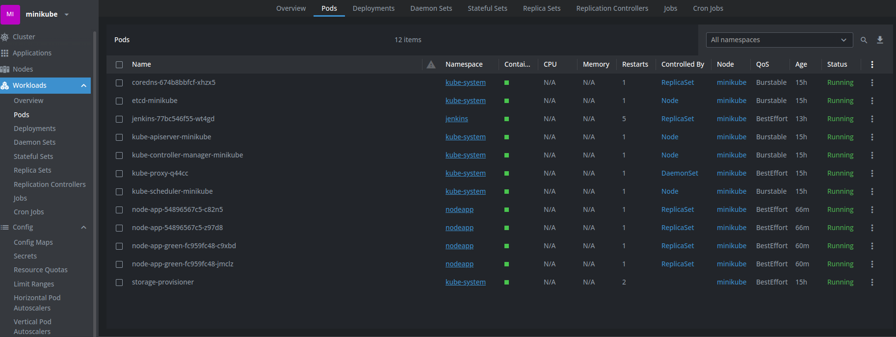

### 3️⃣ Deploying Jenkins on Minikube

Prepared the need Kubernetes manifests:

- A Deployment for Jenkins

- A Service of type NodePort to expose Jenkins 

Once the pod is ruuning , I forwarded the service already created using:

<pre lang="md"> ```minikube service jenkins -n jenkins ``` </pre> ,and the server is ready and responding :

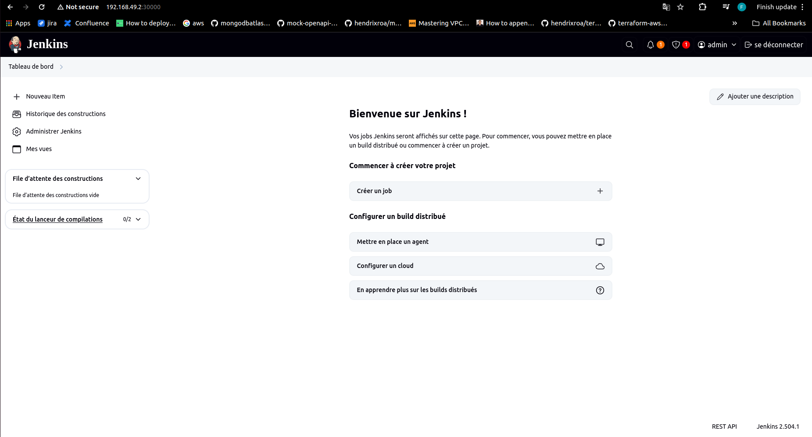


### 4️⃣ Blue/Green Node.js Deployment

A sample Node.js application is deployed in the nodeapp namespace with both blue and green deployments.

The service is initially pointing to the blue deployment.

**The application is accessible at: http://192.168.49.2:30080/**


To switch the service to point to the green deployment:
 
<pre lang="md"> ```kubectl patch service node-app \
  -p '{"spec": {"selector": {"app": "node-app", "version": "green"}}}' ``` </pre>

### ⚙️ Automating the Deployment

The setup is automated using a bash automation script , to run it do :
 
<pre lang="md"> ```chmod 777 automation.sh ``` </pre>
<pre lang="md"> ```./automation.sh ``` </pre>


# **☁️ Deploying Jenkins on AWS EKS using Terraform**

### 1️⃣ Setting Up EKS

- Navigate to the eks-tf/ directory.

- Initialize Terraform and apply the configurations using:

<pre lang="md"> ```terraform init ``` </pre>
<pre lang="md"> ```terraform workspace new assessment``` </pre>
<pre lang="md"> ```terraform apply ``` </pre>

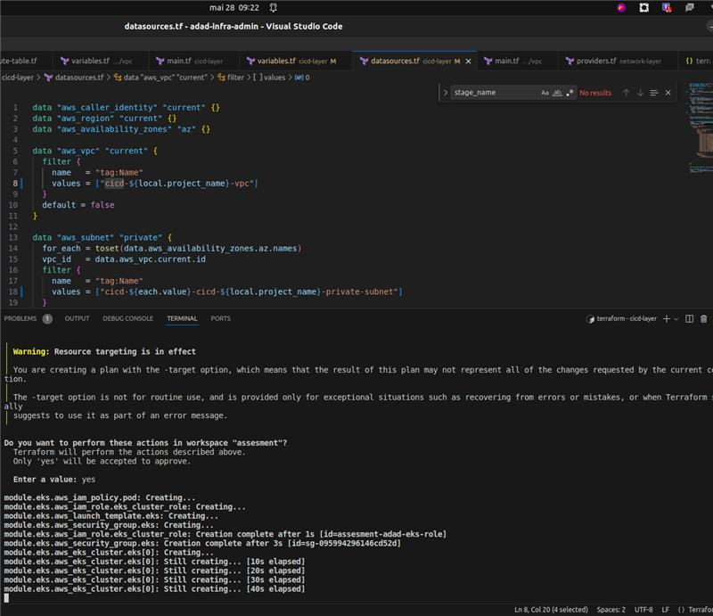

Then you can see that the cluster is creating from the AWS console : 

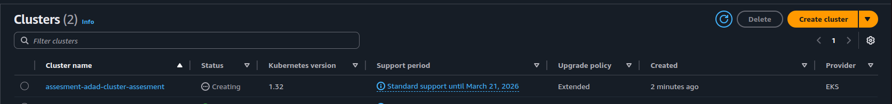

Once the cluster is created :

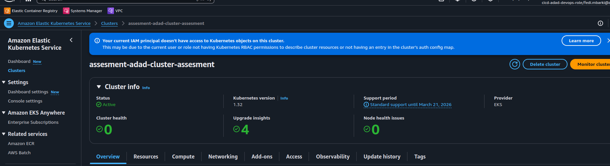

### 2️⃣ Installing Jenkins on EKS with Helm


After that , I am going now to launch jenkins ( with JDK 21) on the eks cluster using a helm chart based on my configuration (AWS/EKS)

I will use and efs voulme for creating the persistent volume and a claim for mounting Jenkins volume.


1.Create a namespace: 


<pre lang="md"> ```kubectl create namespace adad-jenkins ``` </pre>

2.Install Jenkins using Helm (with JDK 21 and custom config):

<pre lang="md"> ```helm install jenkins jenkins_chart/ -n adad-jenkins  ``` </pre>

once the jenkins is ready :

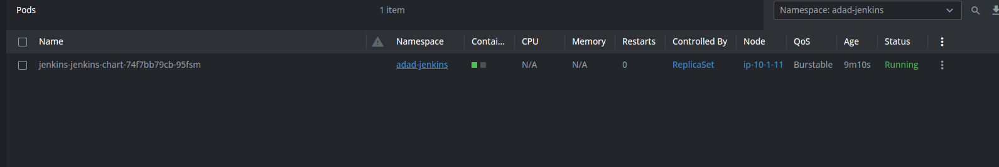

I will port forward to the service to access it : 

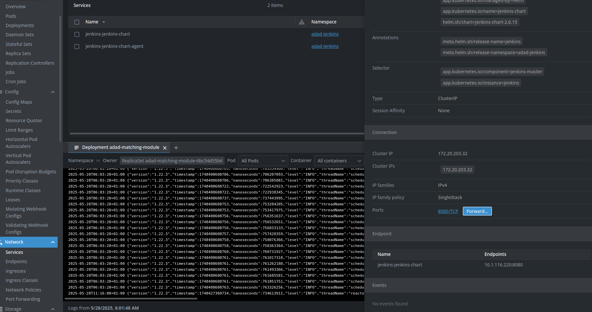

Now We can access jenkins UI: 

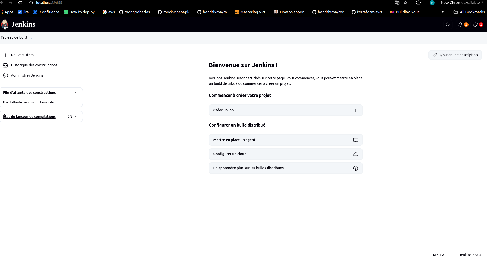

### 3️⃣ Integrating Jenkins with Kubernetes


Install the Kubernetes plugin in Jenkins and configure it to connect to the same EKS cluster it is running in.

This allows Jenkins to manage dynamic agents (pods) inside the EKS cluster.

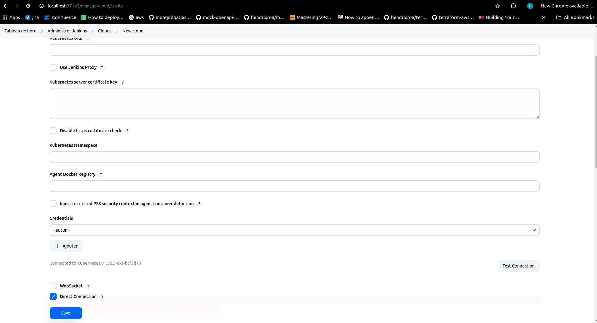 


### 4️⃣  Demostrating a blue green deployment with Jenkins

Initially, the application is live with the blue deployment as you can see in the screenshoot


and the service routes traffic to the blue pods.

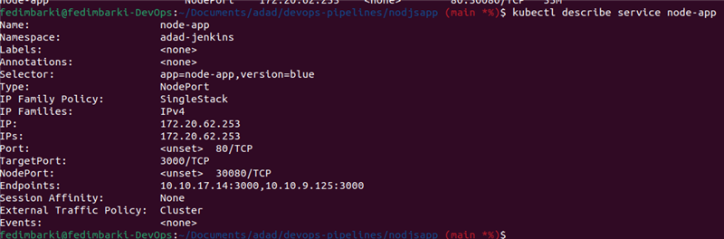

then after define the Jenkins pipline under (nodjsapp/Jenkinsfile) with steps :


 ## Deploy Green Version : 
 A new version of the application (green) is deployed in parallel alongside the blue version. It does not receive traffic yet.

 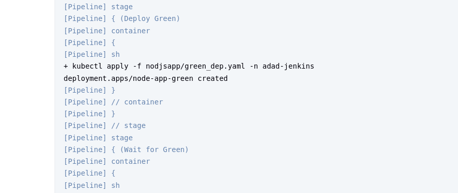

 ## Wait for Readiness
The pipeline waits until the green pods are up and running successfully.

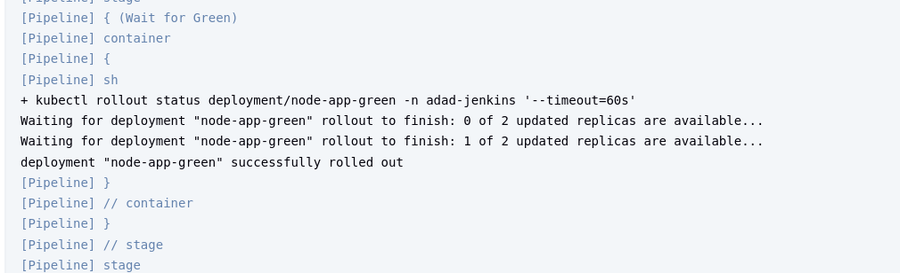

 ## Smoke Testing
The pipeline performs a basic health check on the green deployment (e.g., via HTTP call or port-forwarding) to verify it's functioning correctly.

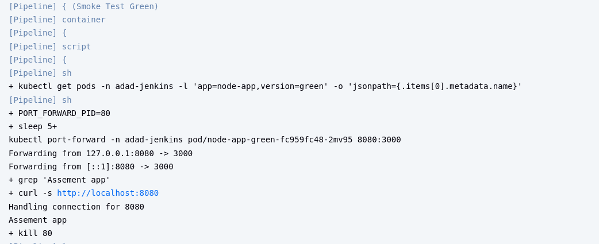

## Switch Traffic to Green
If the smoke test passes, the service selector is updated to point to the green deployment, effectively switching  traffic from blue to green.

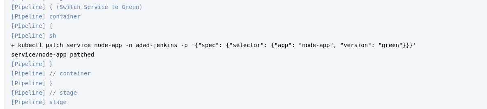 

## Decommission Blue
The blue deployment is scaled down or stopped to free up resources.

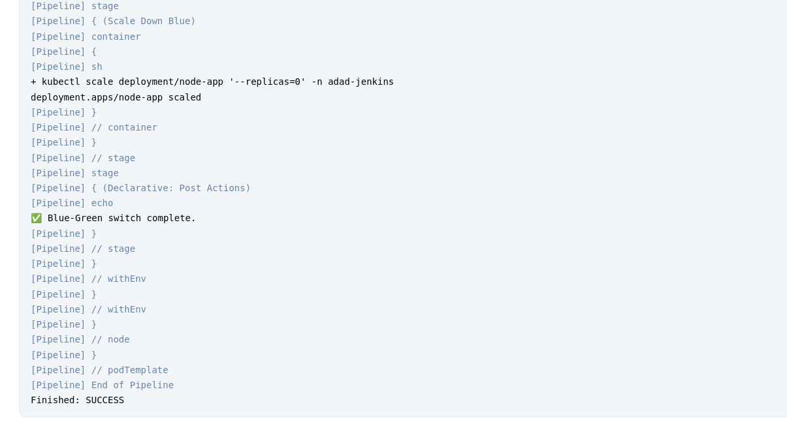

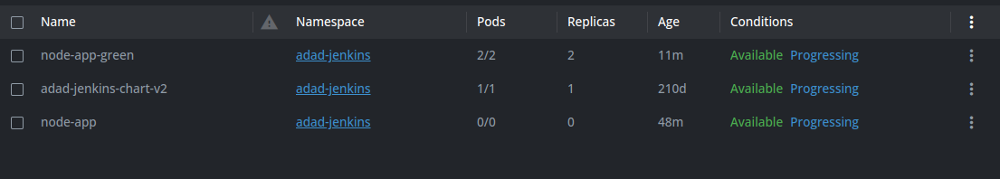

## Pipeline Results


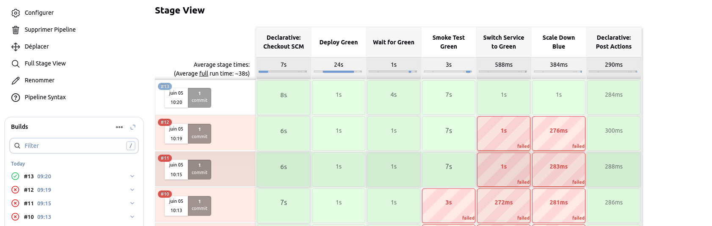